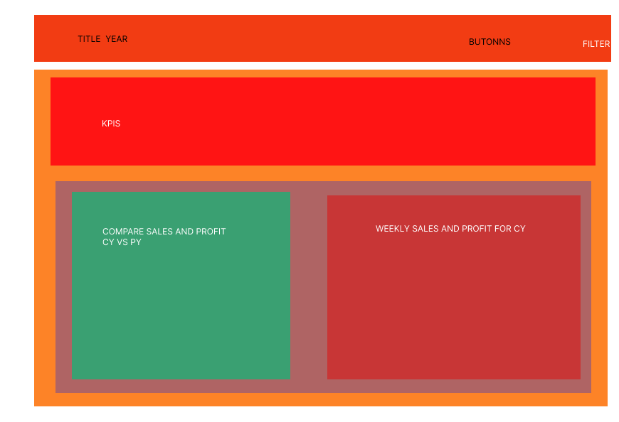
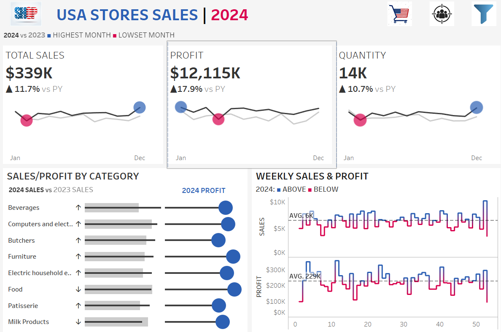
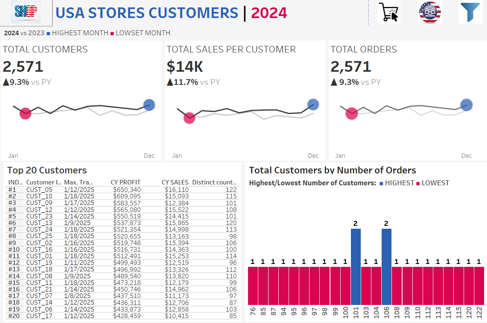
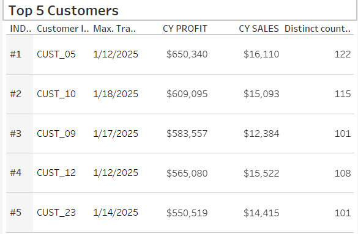

# Project USA Stores!!!
✌🏻💯

A complete data analysis and visualization project simulating the sales performance of a U.S.A. This project utilizes real-world sales data enriched with geographical context to provide actionable business insights.

---

## 📑 Table of Contents

* [🔍 Project Overview](#-project-overview)
* [🛠 Tech Stack](#-tech-stack)
* [🧹 Data Preparation](#-data-preparation)
  * [📁 Data Source](#-data-source)
* [SQL Data Cleaning Process](#sql-data-cleaning-process)
* [📈 Sales Dashboard](#-sales-dashboard)
* [👥 Customer Dashboard](#-customer-dashboard)
* [🧭 Interactivity & Filters](#-interactivity--filters)
* [🖼️ Screenshots](#-screenshots)
* [💭 Recommendations](#-Recommendations)
* [🚀 How to Use](#-how-to-use)
* [✅ Project Outcome](#-project-outcome)
* [👨‍💻 Author](#-author)

---

## 🔍 Project Overview

**Objective:**  
Provide a business-ready, interactive dashboard that analyzes year-over-year stores sales and customer behavior trends across the USA. This includes:

- 📊 Yearly & Monthly Sales Trends  
- 💰 Profit Analysis & KPIs  
- 🛒 Product Subcategory Performance  
- 🧑‍🤝‍🧑 Customer Loyalty & Engagement  
- 📍 Regional & State-Based Filters  

---

## 🛠 Tech Stack

- **Microsoft Excel** – Initial data exploration  
- **SQL (VS Code)** – Data cleaning & transformation  
- **Tableau** – Interactive visual dashboards  
- **GitHub** – Version control & collaboration  

---

## 🧹 Data Preparation

### 📁 Data Source
[View the data Retail Store Sales: Dirty for Data Cleaning](https://www.kaggle.com/datasets/ahmedmohamed2003/retail-store-sales-dirty-for-data-cleaning)

The raw dataset was downloaded from Kaggle and enriched with U.S.A geographical data:

- `country` ➝ All rows labeled as `"USA"`  
- `state` ➝ U.S.A. states generated and mapped  
- `region` ➝ Categorized into `East`, `West`, `North`, `South`  

---

## SQL Data Cleaning Process

> **Cleaned and structured using SQL in VS Code.**  
> ✅ Create Database and Import the Data in MySql manual
> ✅ Connect VS Code with MySql
> ✅ See the data and duplicate the table us_stores

```sql
/*
SELECT
    *
FROM us_stores;

CREATE TABLE us_stores_clean like us_stores;

SELECT
    *
FROM us_stores_clean;

INSERT into us_stores_clean 
select * from us_stores;
*/
```

> ✅ Rename the columns

```sql
/*
SELECT * from us_stores_clean;

ALTER TABLE us_stores_clean
RENAME COLUMN `Transaction ID` to TransactionID;

ALTER TABLE us_stores_clean
RENAME COLUMN `Customer ID` to CustomerID;

ALTER TABLE us_stores_clean
RENAME COLUMN `Price Per Unit` to UnitPrice;

ALTER TABLE us_stores_clean
RENAME COLUMN `Total Spent` to TotalSpent;

ALTER TABLE us_stores_clean
RENAME COLUMN `Payment Method` to PaymentMethod;

ALTER TABLE us_stores_clean
RENAME COLUMN `Transaction Date` to TransactionDate;

ALTER TABLE us_stores_clean
RENAME COLUMN `Discount Applied` to DiscountApplied;
*/
```

> ✅ Remove Duplicates

```sql
/*
SELECT
    *
from (    
    SELECT
        *,
        ROW_NUMBER() over(PARTITION BY TransactionID, 
                                        CustomerID, 
                                        Category, 
                                        Item, 
                                        UnitPrice,
                                        Quantity, 
                                        TotalSpent, 
                                        PaymentMethod, 
                                        `Location`, 
                                        TransactionDate, 
                                        DiscountApplied, 
                                        Profit) as duplicated
    FROM us_stores_clean
) d
where duplicated > 1;

--THERE IS NOT DUPLICATED ROWS
*/
```

> ✅ Explore the columns and normalize the data

```sql
/*
DESCRIBE us_stores_clean;

SELECT
    Distinct TransactionID
FROM us_stores_clean
order by TransactionID;
---WE DONT HAVE PROBLEM WITH THE TRANSACTIONID COLUMN

SELECT
    DISTINCT CustomerID 
FROM us_stores_clean;
---WE DONT HAVE PROBLOEM WITH THE CUSTOMERID COLUMN

SELECT
    DISTINCT Category
from us_stores_clean
ORDER BY Category;
---WE DONT HAVE PROBLEM WITH THE CATEGORY COLUMN

SELECT
    DISTINCT Item
FROM us_stores_clean
where Item = ''
ORDER BY Item DESC;

DELETE FROM us_stores_clean
where Item = '' or Item is null
---THE ITEM COLUMN FIXED

SELECT
    DISTINCT UnitPrice
FROM us_stores_clean
ORDER BY UnitPrice;
---WE DONT HAVE PROBLEM WITH THE UNITPRICE COLUMN

SELECT
    DISTINCT Quantity
FROM us_stores_clean
ORDER BY Quantity;

ALTER TABLE us_stores_clean
Modify COLUMN Quantity int;
---COLUMN QUANTITY FIXED

SELECT
    DISTINCT TotalSpent
from us_stores_clean
order BY TotalSpent DESC;

ALTER TABLE us_stores_clean
Modify COLUMN TotalSpent double;
---COLUMN TOTALSPENT FIXED

SELECT
    DISTINCT PaymentMethod
from us_stores_clean
ORDER BY PaymentMethod;
---WE DONT HAVE PROBLEM WITH THE PAYMENTMETHOD COLUMN

SELECT
    DISTINCT `Location`
FROM us_stores_clean
ORDER BY `Location`;
---WE DONT HAVE PROBLEM WITH THE LOCATION COLUMN

SELECT
    DISTINCT TransactionDate, str_to_date(TransactionDate, '%m/%d/%Y')
FROM us_stores_clean
ORDER BY TransactionDate;

UPDATE us_stores_clean
set TransactionDate = str_to_date(TransactionDate, '%m/%d/%Y');

ALTER TABLE us_stores_clean
Modify COLUMN TransactionDate date;
---COLUMN TRANSACTIONDATE FIXED

SELECT
    DISTINCT DiscountApplied,
    Count(*)
FROM us_stores_clean
where DiscountApplied is null or DiscountApplied in ('', ' ')
GROUP BY DiscountApplied
ORDER BY DiscountApplied;

DELETE FROM us_stores_clean
where DiscountApplied = '';
---COLUMN DISCOUNTAPPLIED FIXED

SELECT
    DISTINCT Profit
FROM us_stores_clean
ORDER BY Profit;
---WE DONT HAVE PROBLEM WITH THE PROFIT COLUMN

SELECT
    DISTINCT Country 
FROM us_stores_clean
UNION ALL
SELECT
    DISTINCT `State`
from us_stores_clean
union ALL
select
    DISTINCT Region
FROM us_stores_clean;
---WE DONT HAVE PROBLEM WITH THE COUNTRY, STATE, REGION COLUMNS
*/
```

> ✅ See the cleaned data

```sql
/*
DESCRIBE us_stores_clean;
SELECT
    *
FROM us_stores_clean;

SELECT
    count(*)
from us_stores_clean;
```
---

## 📈 Sales Dashboard

The **Sales Dashboard** offers a deep dive into business performance across time, products, and regions.

### Key Features

- 📅 **KPI Overview:** Total Sales, Profit, Quantity (Current & Previous Year)  
- 📉 **Sales Trends:** Monthly comparison with highlights of best/worst months  
- 🧾 **Category Comparison:** Sales vs. Profit per Category  
- 📆 **Weekly Trends:** Weekly analysis with average line & variance indicators  

[View the USA SALES DASHBOARD](https://public.tableau.com/app/profile/chris.zogas/viz/USSTORESDASHBOARD/USASALESDASHBOARD)

---

## 👥 Customer Dashboard

Designed for marketing and strategy teams, this dashboard uncovers customer behavior patterns.

### Key Features

- 🔢 **KPI Overview:** Customers, Orders, Sales per Customer  
- 📆 **Customer Trends:** Monthly KPI breakdown  
- 📊 **Order Distribution:** Loyalty & engagement insights  
- 🥇 **Top 10 Customers by Profit:** Ranked by profit, with details  

[View the USA CUSTOMERS DASHBOARD](https://public.tableau.com/app/profile/chris.zogas/viz/USSTORESCUSTOMERSDASHBOARD/USACUSTOMERSDASHBOARD?publish=yes)

---

## 🧭 Interactivity & Filters

- 📌 **Dynamic Year Selector**
- 🔝 **Top Customers Selector** 
- 📍 **Filters by Region, State**  
- 🛍️ **Filters by Category, Payment Method**  
- 📈 **Clickable Visuals** – Drill into segments directly from charts  

---

## 🖼️ Screenshots

| Mockup Dashboard | Sales Dashboard | Customer Dashboard |
|------------------|-----------------|--------------------|
|  |  |  |

---

## 💭 Recommendations

Based on the insights derived from the dashboards, the following recommendations are suggested to enhance business performance:

1. Peak sales Month
   According to the tableau sales dashboard the month with the highest sales is January for the most years.
   So this indicates a strong trend and the companies should increase the inventory and launching promotions.

2. Investigate under performing Time periods
   The lowest sales performance occured in August in most years and February.
   Maybe this months is the months that the discounts is over and the people don't buy many products.
   It's reccomending that the companies may have a new marketing proposal for these months.

3. High/Low Profit Category
   The categories with thw highest profits over the years are the food and computer and electrics.
   This means that the USA companies should look to increase the items of those categories and start to sell more and more.
   The categories with the lowest profits over the years are the butchers and the patisseries.
   The USA companies have two options, the first is to discard this categories from the supermarkets and the other is to create a stratigic campaign for that category items to increase the customers

4. Improve Weekly Sales Consistency
   Weekly trend analysis shows major fluctuations, with 23 weeks being below average in 2024.
   Investigating these dips can help stabilize cash flow and avoid missed sales opportunities.

5. Reward and Retain Top Customers
   The top 5 customers contributed to almost 3M of total profits. Retaining these VIP clients through exclusive perks or dedicated account management could further boost lifetime value.
   
  
---

## 🚀 How to Use

1. Clone the repo  
   ```bash
   git clone https://github.com/CHRISZOG10/usa-stores.git
   ```
2. Open the Tableau Workbook: `assets/USA Stores Dashboards/US STORES DASHBOARD.twbx`  
3. Explore both dashboards and try the interactivity features

---

## ✅ Project Outcome

This project demonstrates real-world skills in:

- End-to-end data pipeline creation  
- Cleaning and preparing large retail datasets  
- Advanced dashboard design in Tableau  
- Delivering business insights through KPIs & trends  
- Building interactive, user-driven visual experiences  

---


## 👨‍💻 Author

**Your Name**  
📧 [christoszogas97@gmail.com](mailto:christoszogas97@gmail.com)  
🔗 [LinkedIn](https://linkedin.com/in/christos-zogas-804323320)  
